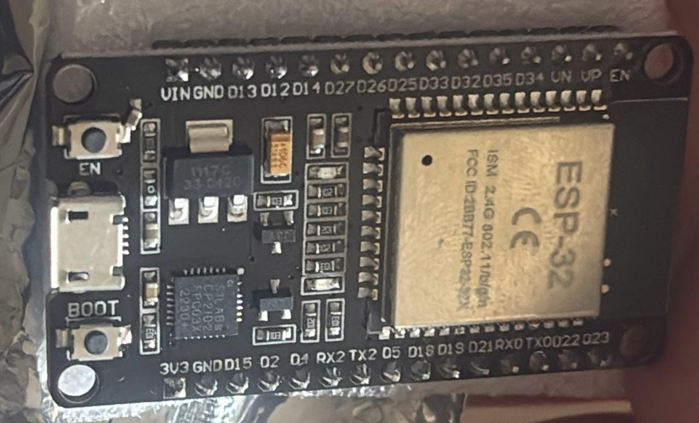

# ESP32 Wake-on-LAN Telegram Bot
<p align="center">
  
</p>

An **ESP32-based Telegram bot** that can remotely power on your PC using **Wake-on-LAN (WOL)** magic packets.  
This project turns a low-power ESP32 dev board into a dedicated device for waking your PC from anywhere, controlled securely through your personal Telegram account.

---

## 🚀 Features
- Wake your PC from anywhere with `/wol` command  
- Controlled securely via Telegram Bot Token + User ID  
- Lightweight, low-power solution (ESP32 uses <0.5W)  
- Automatic reboot every 4 hours to prevent freezes  
- Works without Raspberry Pi, static IP, or local servers  

---

## 🛠️ Setup Process

### 1. Hardware & Drivers
- Board: ESP32-WROOM-32 Dev Kit (SquadPixel, DOIT DevKit V1, etc.)  
- Install [Arduino IDE](https://www.arduino.cc/en/software)  
- Add ESP32 board package (`https://dl.espressif.com/dl/package_esp32_index.json`) in **File → Preferences**  
- Install [CP210x USB-to-UART Bridge drivers](https://www.silabs.com/developers/usb-to-uart-bridge-vcp-drivers?tab=downloads)  
- In Arduino IDE, select **Board → ESP32 Arduino → DOIT ESP32 DEVKIT V1**  

Here’s how the Arduino IDE looks once configured:  


---

### 2. Create a Telegram Bot
1. In Telegram, search **@BotFather** → `/newbot`  
2. Copy the **Bot Token** it provides  
3. Get your **Telegram User ID** via [@userinfobot](https://t.me/userinfobot)  
4. Save both — they’ll be added into the code  

---

### 3. Configure Arduino Code
Install required libraries in Arduino IDE:
- [WakeOnLan](https://www.arduino.cc/reference/en/libraries/wakeonlan/)  
- [UniversalTelegramBot](https://www.arduino.cc/reference/en/libraries/universaltelegrambot/)  
- [ArduinoJson](https://arduinojson.org/)  

Update the `.ino` file with your credentials (use placeholders before pushing to GitHub):
```cpp
#define BOT_TOKEN  "your_bot_token_here"
#define ALLOWED_ID "your_user_id_here"

#define WIFI_SSID  "your_wifi_ssid"
#define WIFI_PASS  "your_wifi_password"

#define MAC_ADDR   "XX:XX:XX:XX:XX:XX"   // target PC MAC address
````

---

### 4. Flash and Run

* Connect ESP32 via USB and select correct **COM port** in Arduino IDE
* Upload the sketch
* Open Serial Monitor to confirm WiFi + Telegram connection

Here’s the ESP32 board used in this project:


---

## 📱 Usage

Once powered, the ESP32 automatically connects to WiFi + Telegram and listens for commands.

* `/start` → shows available commands
* `/wol` → sends the magic packet, waking up your PC

Example bot interaction:


---

## 🎥 Live Demo

Here’s a live demo of the project in action:

<video src="./images/video.mp4" controls autoplay muted></video>

---

## 📚 References

This project was inspired and adapted from:

* [coppermilk/esp32_wol_telegrambot (GitHub repo)](https://github.com/coppermilk/esp32_wol_telegrambot)
* [ESP32 WakeOnLan: Remote Computer Start – by Artem Ger (Medium)](https://medium.com/@coppermilk/esp32-wakeonlan-remote-computer-start-d5443b37e15d)
* [How to set up ESP32-WROOM-32 – by Samuel Adesola (Medium)](https://samueladesola.medium.com/how-to-set-up-esp32-wroom-32-b2100060470c)
* [Setting up an ESP-WROOM-32 – by Jethro Muller](https://jethromuller.co.za/blog/tag/ESP32)
